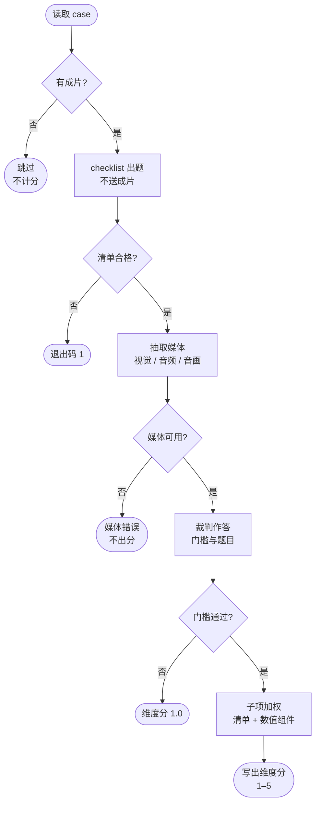
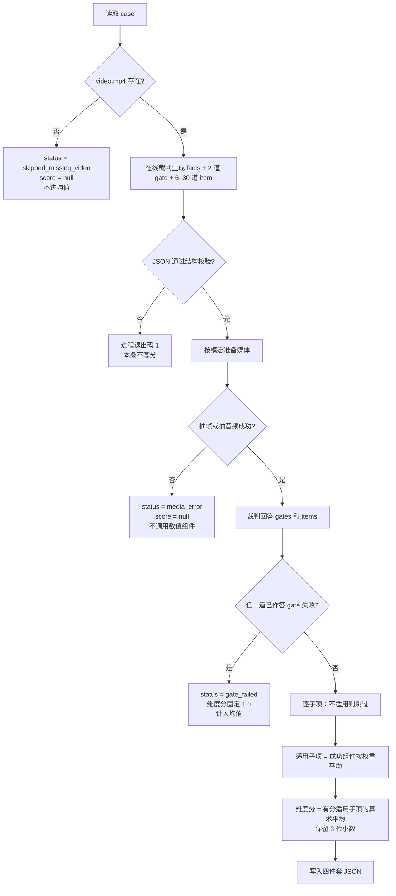
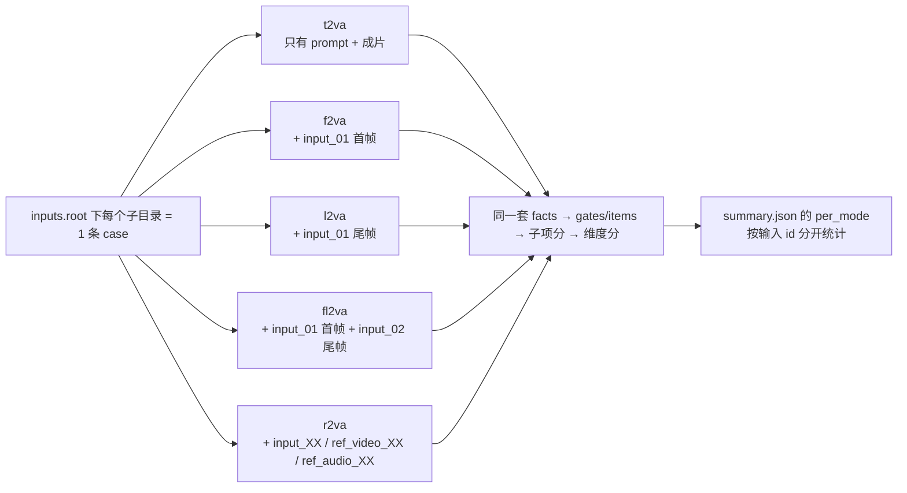
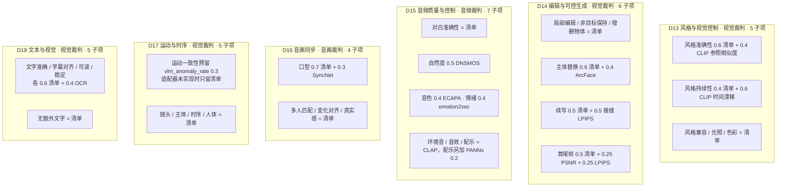
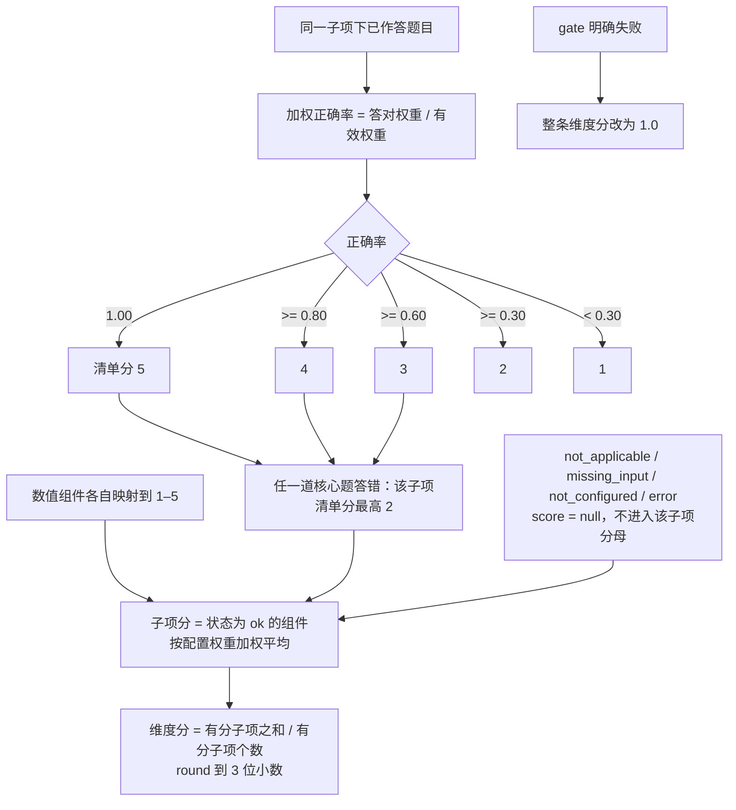
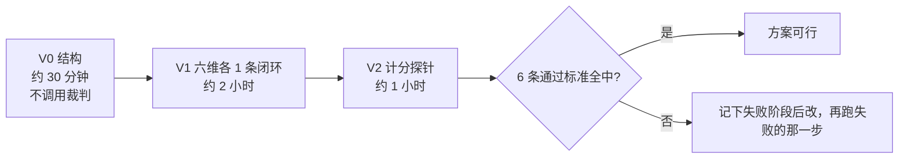

# 第 13–18 维度：做法、可行性验证与核收

本文说明当前代码里第 13–18 维怎么跑通、用什么最小实验判断方案可行、做完按什么数字核收。子项定义、计分阈值和组件换算见 [第 13–18 维度：当前评测规则与评估方案](./第%2013–18%20维度：当前评测规则与评估方案.md)。代码根目录：

```text
/home/ubuntu/lt-self/V-eval/eval_demension
```

当前实现范围：6 个维度、32 个子项、5 种输入模式、18 个已注册数值适配器。D17 的 `vlm_anomaly_rate` 只保留开关，本地适配器未实现。D16 的 SyncNet v2 通过外部命令接入，评测器本身不捆绑权重。

---

## 1. 怎么做

### 1.1 总框架

一条 case 从上到下只走一条主路径。菱形是判断，右侧是离开主路径的结果。六个维度共用这条路径，差别只在抽媒体时用视觉、音频还是音画。



### 1.2 单条 case 怎么走



四阶段命令：

```bash
cd /home/ubuntu/lt-self/V-eval/eval_demension
.venv/bin/python run.py --task-config configs/task_d13_example.yaml
```

`task_d14` 到 `task_d18` 只换配置文件。`--stages check` 只发现输入。`--force` 忽略已有缓存。

### 1.3 五种输入怎么挂到同一套评分



一份任务配置里列出五种 `mode`。某个模式目录还不存在时，`allow_missing_root: true` 会跳过该模式，不中断其他模式。

### 1.4 六维各自评什么、用什么分



适用条件由 `facts` 决定。例如没有目标光照就不评 D13 光照；没有首尾帧就不评 D14 端点；没有对白就不评 D16 口型。不适用子项不进入维度平均。

答题时的媒体协议：

| 裁判 | 维度 | 成片怎么送 |
|---|---|---|
| 视觉 | D13、D14、D17、D18 | 全片均匀抽帧，时长×2 fps，最多 32 帧，长边 640，JPEG 质量 90；条件图长边随图块送入 |
| 音频 | D15 | 成片抽成 16 kHz 单声道；另可附最多 2 条参考音频 |
| 音画 | D16 | 按题目时间窗切对齐的画面和音轨。默认最多 4 窗、合计 12 秒；每窗 2 fps、最多 6 帧、长边 448 |

### 1.5 分数怎么合成



未作答的题不进正确率分母。组件没装好时记 `not_configured`，不记 0 分，也不记满分。子项里只剩清单成功时，清单权重按剩余成功组件重新归一。

---

## 2. 怎么验证方案可行

这一节是最小验证，用来判断这条流水线能不能作为评测方案用。它不代替第 3 节的批量核收。

前提：视觉裁判和音频裁判的 URL、模型名、API key 已经写进环境变量；本机有 `ffmpeg` / `ffprobe`。数值模型权重可以先不装。裁判服务冷启动时间不计入下面的墙钟预算。

### 2.1 最小验证做三步



总预算：**4 小时**。权重首次下载、裁判服务部署不在这 4 小时里。

#### V0 结构可运行（≤ 30 分钟）

```bash
cd /home/ubuntu/lt-self/V-eval/eval_demension
.venv/bin/python -m unittest tests/test_d16_first_version.py
for cfg in configs/task_d1{3,4,5,6,7,8}_example.yaml; do
  .venv/bin/python run.py --task-config "$cfg" --stages check
done
```

通过标准：

- 单测 **12/12** 通过。这 12 条覆盖：抽帧失败不送裸 prompt、`media_error` 不出分且不跑数值组件、未配置 SyncNet 为 `not_configured`、`not_configured` 不进加权分母。
- 6 个任务配置退出码都是 **0**。
- 每个维度的 check 日志能打印 case 数、有视频的条数、五种模式里实际发现的模式。

#### V1 六维各跑通 1 条（≤ 2 小时）

每个维度选 **1 条有视频** 的 case，五种模式里优先用手头已有的那一种（现有样例是 `t2va`）。`case_ids` 只填这一条，然后跑满 `check checklist evaluate score`。

每条成功时墙钟按 **2 次裁判调用** 估算：出题 1 次（`max_tokens=6000`，不送成片），答题 1 次（`max_tokens=4096`，送媒体）。6 维合计 **12 次**裁判调用。单次按 60–90 秒估，纯推理约 12–18 分钟；2 小时预算留给 JSON 不合格后的 **1 次** `--force` 重试和结果核对。

通过标准（6 条都要满足）：

| 检查项 | 标准 |
|---|---|
| 进程 | 退出码 0 |
| 四件套 | `facts.json`、`checklist.json`、`answers.json`、`result.json` 都在 |
| 清单版本 | `version = 2` 且 `judge_mode = external` |
| 题目 | item 数 ∈ **[6, 30]**，核心题 ≤ **3**，gate 数 = **2** |
| 分数 | `status = ok` 时 `score` ∈ **[1.000, 5.000]**，且等于子项分手工平均，绝对误差 ≤ **0.001** |
| 批次 | `summary.json` 的 `n = 1`，`scored = 1` 或该条为 `gate_failed` 时 `gate_failed = 1` 且 `mean_score = 1.0` |

六条里允许 **0 条** `media_error` 或 `skipped_missing_video`。选条时就选有完整视频、音轨可抽取的成片。checklist JSON 两次都校验失败，该维记为未通过。

#### V2 计分探针（≤ 1 小时）

用 V1 里已经生成的 `result.json`，再补 3 个对照，不必重新准备六维数据。

| 探针 | 做法 | 通过标准 |
|---|---|---|
| 缺视频 | 复制 1 条 case，删掉 `video.mp4` 后重跑 | `status = skipped_missing_video`，`score = null`，`summary` 的均值不包含它 |
| 组件未安装 | 看 V1 结果里任一数值组件 | `status` 为 `not_configured` / `not_applicable` / `missing_input` / `error` 时 `score = null`；子项分只用状态为 `ok` 的组件 |
| 权重回退 | 找一条 `syncnet_conf` 或 CSD 为 `not_configured` 的口型或风格子项 | 子项分等于剩余清单分，绝对误差 ≤ **0.001** |

D16 的「媒体失败不出分」「未配置 SyncNet 不进分母」已由 V0 的 12 条单测锁定，V2 不再用真视频重做这两件事。

### 2.2 什么叫方案可行

下面 6 条同时成立，记为方案可行：

1. V0：**12/12** 单测通过，**6/6** 配置 check 退出码 0。
2. V1：**6/6** 维度各 1 条闭环，退出码 0，四件套齐全。
3. 这 6 条的清单 item 数都在 **6–30**，gate 都是 **2** 道，核心题都 ≤ **3**。
4. 这 6 条的 `status` 都是 `ok` 或 `gate_failed`；`ok` 的分数在 **[1, 5]**，`gate_failed` 的分数是 **1.0**。
5. 未就绪组件的 `score` 都是 **null**，子项分与「只平均 ok 组件」的手工结果误差 ≤ **0.001**。
6. 墙钟 ≤ **4 小时**（不含裁判部署和模型下载）。超时要单独说明卡在出题、答题还是某个数值组件，不能只报「跑得很慢」。

---

## 3. 做完怎么核收

核收看一批真实 case 的产物，不看单条演示。数值模型未安装时，核收单要写明哪些组件是 `not_configured`；这些组件不要求 `ok`，也不得贡献分数。

### 3.1 核收批次

| 项 | 数字 |
|---|---|
| 维度 | **6** 个都要有独立 `summary.json` |
| 每维有视频的 case | **≥ 20**。现有数据不足 20 时跑全量，核收单写实际 N |
| 输入模式 | 数据里有的模式都要出现在 `per_mode`；没有目录的模式可以缺席，但配置里仍保留 5 种入口 |
| 抽检 | 每维随机 **5** 条，合计 **30** 条，对照 prompt 和成片看 facts / 题目 / 证据 |

建议墙钟：裁判已热、数值模型已缓存时，6 维 × 20 条串行 ≤ **8 小时**。单条 P95：视觉维 ≤ **180 秒**，音频维与音画维 ≤ **240 秒**（不含进程内第一次加载大模型）。

### 3.2 核收数字

分母一律是「有视频的 case」。`skipped_missing_video` 不进分母。

| 编号 | 核收项 | 合格线 |
|---|---|---|
| A1 | 批跑完成 | 6 个维度退出码都是 **0**，各有 `summary.json`、`summary.md`、`per_case.jsonl` |
| A2 | 可评率 | 每维 `(ok + gate_failed) / 有视频条数 ≥ 95%`。`media_error` 与异常中断合计 ≤ **5%** |
| A3 | 分数合法 | 每条 `ok` 或 `gate_failed` 的 `score` ∈ **[1.000, 5.000]**；`gate_failed` 必须等于 **1.0**；`mean_score` 与分数列手工平均的绝对误差 ≤ **0.001** |
| A4 | 清单约束 | 抽检 30 条全部 `version = 2`；item ∈ **[6, 30]**；核心题 ≤ **3**；gate = **2**；子项 id 都属于该维配置。越权题 **0** 条 |
| A5 | 事实抽检 | 30 条里 facts 与 prompt 一致 ≥ **24/30（80%）**。一致指：prompt 写了的要求能在 facts 里找到，prompt 没写的开关不为真 |
| A6 | 证据抽检 | 30 条的已作答题里，抽 **60** 道（每条 2 道），证据带时间指向且和画面或声音相符 ≥ **48/60（80%）** |
| A7 | 不适用 | 抽检里，facts 不满足的子项 `applicable = false` 且 `score = null`，比例 **100%** |
| A8 | 数值组件 | 已安装且本条适用的组件，`status = ok` 的比例 ≥ **90%**。未安装组件 `status = not_configured` 且 `score = null` 的比例 **100%** |
| A9 | 产物齐全 | 每条有视频 case 都有四件套。`per_case.jsonl` 行数 = `summary.n` |
| A10 | 缓存 | 不带 `--force` 再跑同一条，`result.json` 分数差 = **0**。带 `--force` 重跑后四件套仍齐全，分数仍在 **[1, 5]** |

A5、A6 由验收人看片勾选。其余项可以从 `result.json` 和 `summary.json` 算出来。

### 3.3 组件可用性单独记账

18 个已注册适配器在「权重已放进 `V_EVAL_MODEL_DIR`、依赖已安装」时，每个至少用 **1** 条适用 case 打出 `status = ok` 且分数 ∈ **{1, 2, 3, 4, 5}**：

| 维度 | 必须能打出 ok 的组件 | 条数 |
|---|---|---|
| D13 | `csd_ref_similarity`、`csd_temporal_drift` | 各 ≥ 1 |
| D14 | `arcface_identity_keep`、`continuation_seam_lpips`、`endpoint_psnr`、`endpoint_lpips` | 各 ≥ 1 |
| D15 | `dnsmos_ovr`、`ecapa_same_speaker`、`emotion2vec_match`、`clap_ambient`、`clap_sfx`、`clap_music`、`music_presence` | 各 ≥ 1 |
| D16 | `syncnet_conf`（需配置 `V_EVAL_SYNCNET_COMMAND`） | ≥ 3 条有对白 case |
| D18 | `ocr_cer`、`ocr_subtitle_alignment`、`ocr_readability`、`ocr_text_stability` | 各 ≥ 1 |

未声明安装的组件不进上表，核收单写 `not_configured`。D17 的 `vlm_anomaly_rate` 当前没有适配器，核收时允许 `not_configured`，运动一致性子项按清单分验收。SyncNet 未配置时，口型子项按清单分验收，核收单写明「SyncNet 未接入」。

### 3.4 核收结论

A1–A10 全部达到合格线，并且 3.3 里「已声明安装」的组件都有对应 `ok` 样本，记为 **通过核收**。

任一 A 项未达标，记为 **不通过**。返回时写明编号、实际数字和期望数字，例如「D16 可评率 18/20 = 90%，低于 95%」。不把单条演示分数当成核收结论。
