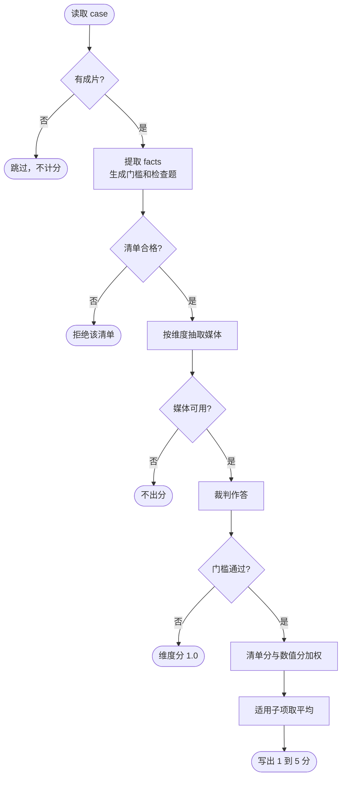

# 第 13–18 维度：评估流程、验证与核收

六个维度共用一条流水线。每条 case 先从 prompt 抽出需求，再出题、看片或听声作答，适用时加入数值分，最后合成 1–5 分。

## 一、评估流程怎么做

这条流程参考了 VBench 的思路。VBench 把视频生成质量拆成多个维度，每个维度单独打分，能用专门模型衡量的部分交给专门模型。VBench-2.0 进一步用多道是否题问视频，再把答案合成该维分数。这里沿用这两点：六个维度分开评，清单题答完后与数值分加权。题目按每条 prompt 现编，出题时不看成片。




一条 case 是某个输入根目录下的直接子目录，至少包含 `prompt_final.txt` 和 `video.mp4`。五种输入挂上的条件素材不同，后面的出题、作答和计分相同。

|输入|条件素材|用途|
|---|---|---|
|`t2va`|无|只按 prompt 和成片评估|
|`f2va`|`input_01` 首帧|检查视频是否从指定首帧开始|
|`l2va`|`input_01` 尾帧|检查视频是否停在指定尾帧|
|`fl2va`|`input_01` 首帧，`input_02` 尾帧|同时检查两端|
|`r2va`|`input_XX`、`ref_video_XX`、`ref_audio_XX`|按 prompt 中的引用使用参考图、参考视频或参考音频|

出题和答题分成两次裁判调用。出题只读 prompt、输入模式和维度规则，不送成片。答题才送媒体：D13、D14、D17、D18 用视觉裁判；D15 用音频裁判；D16 用音画裁判。视觉抽帧为全片均匀取样，时长 × 2 fps，最多 32 帧，长边 640。音频为 16 kHz 单声道。D16 按题目时间窗对齐切出画面和音轨，默认最多 4 窗、合计 12 秒。

`facts` 决定哪些子项适用，本身不计分。每个维度 2 道门槛只判断这条还能不能评。门槛明确失败时，维度分记为 **1.0**，状态为 `gate_failed`，并进入均值。没有成片时状态为 `skipped_missing_video`，不进入均值。

每条清单 6–30 道题，核心题最多 3 道。题目只覆盖 prompt 或输入模式表明适用的子项。题型为是否题，或三选一、四选一。

同一子项的加权正确率按下表换成清单分。未作答的题不进分母。任一道核心题答错，该子项清单分最高为 2。

|加权正确率|清单分|
|---:|---:|
|1.00|5|
|0.80 至小于 1.00|4|
|0.60 至小于 0.80|3|
|0.30 至小于 0.60|2|
|小于 0.30|1|

子项同时有清单和数值组件时，只把打出分数的部分按配置权重平均。不适用的子项不进入维度平均。维度分是有分适用子项的算术平均，保留 3 位小数。

每个 case 写出 `facts.json`、`checklist.json`、`answers.json`、`result.json`。每批写出 `per_case.jsonl`、`summary.json`、`summary.md`。

### 六个维度评什么

|维度|裁判|子项与计分|
|---|---|---|
|D13 风格与视觉控制|视觉|风格准确性：清单 0.6 + 风格参照相似度 0.4。风格持续性：清单 0.4 + 时间漂移 0.6。风格兼容、光照、色彩为清单。光照和色彩仅在 prompt 写明时适用|
|D14 编辑与可控生成|视觉|局部编辑、非目标保持、增删物体为清单。主体替换：清单 0.6 + 人脸身份 0.4。续写：清单 0.5 + 接缝感知差 0.5。首尾帧：清单 0.5 + PSNR 0.25 + LPIPS 0.25。后三项仅在对应事实或端点图存在时适用|
|D15 音频质量与控制|音频|对白准确性为清单。自然度：清单 0.5 + 语音质量 0.5。音色、情绪、环境音、动作音效均为清单 0.6 + 对应音频模型 0.4。配乐：清单 0.6 + 音乐存在性 0.2 + 配乐匹配 0.2。各子项仅在 prompt 有对应要求时适用|
|D16 音画同步|音画|口型：清单 0.7 + 同步置信度 0.3，且需要对白。多人匹配、变化对齐、真实感为清单，且分别需要多人、音画事件或真实感要求|
|D17 运动与时序一致性|视觉|运动一致性：清单 0.7 + 异常比例 0.3。时间连续性为清单。镜头运动、主体一致性、人体运动为清单，且分别需要镜头要求、主体或人体|
|D18 文本与视觉一致性|视觉|目标文字、字幕对齐、可读性、稳定性均为清单 0.6 + 对应 OCR 0.4。无额外文字为清单。文字类子项仅在 prompt 写明目标文字或字幕时适用|

### 专门模型

数值分用的是各维上已经比较成熟的专门模型。清单负责 prompt 里写明、但单靠一个数值不好覆盖的判断；专门模型负责能量成距离、相似度或错误率的部分。运动异常比例由视觉裁判给出，不另接专门模型。

|模型|用在|调研后怎么用|
|---|---|---|
|CLIP ViT-L/14|D13 风格参照、风格漂移|图文对比学习里常用的图像特征。成片按最多 16 帧取特征。有风格参考图时，每帧与参考图做余弦相似度再取平均，不低于 0.80、0.65、0.50、0.35 分别为 5–2 分。没有参考图时，各帧相对全片平均特征的偏离越小越好，不高于 0.05、0.10、0.18、0.28 分别为 5–2 分|
|PSNR|D14 首尾帧|像素级误差。比较生成端点帧和指定首帧或尾帧，不低于 30、26、22、18 dB 分别为 5–2 分。适合看端点是否贴住条件图|
|LPIPS（AlexNet）|D14 首尾帧、续写接缝|用网络特征测感知差，比 PSNR 更接近人眼对糊、色偏的感觉。端点差和续写接缝都不高于 0.08、0.15、0.25、0.40 分别为 5–2 分|
|InsightFace buffalo_l|D14 人脸身份，D16 口型窗口预筛|ArcFace 人脸特征。人物替换时，成片人脸与参照人脸的余弦相似度不低于 0.65、0.55、0.45、0.35 分别为 5–2 分。口型同步前，用它留下至少 40 像素可见人脸的语音窗|
|DNSMOS|D15 语音自然度|无参考语音质量模型，输出整体听感分。不低于 3.6、3.2、2.8、2.3 分别为 5–2 分|
|ECAPA-TDNN|D15 音色|说话人确认里常用的声纹模型。同一说话人或与参考音频的余弦相似度不低于 0.75、0.65、0.55、0.45 分别为 5–2 分|
|emotion2vec+|D15 情绪|语音情绪识别模型。识别结果与 prompt 中的目标情绪一致为 5 分，不一致为 1 分|
|CLAP（HTSAT）|D15 环境音、动作音效、配乐|文本和音频对齐到同一空间。描述与成片音频的余弦相似度不低于 0.45、0.35、0.25、0.15 分别为 5–2 分|
|PANNs Cnn14|D15 音乐有无|音频事件分类模型，读取 Music 类概率。要求有配乐时，概率超过 0.3 的比例不少于一半为 5 分，有一些为 3 分，没有为 1 分。禁止配乐时，最大概率低于 0.2 为 5 分|
|Silero VAD + SyncNet v2|D16 口型|VAD 先找出语音段，InsightFace 再留下有脸的窗口，SyncNet 给出音画同步置信度。置信度不低于 7.0、5.5、4.0、2.5 分别为 5–2 分，时间偏移只作诊断|
|PP-OCRv5|D18 文字|检测加识别。目标文字和字幕按识别结果与要求文本的字符错误率计分，不高于 0.05、0.15、0.30、0.50 分别为 5–2 分。可读性看识别出的文字是否够多，稳定性看这些文字在抽帧里是否反复出现|

运行某一个维度：

```bash
python run.py --task-config configs/task_d13_example.yaml
```

D14–D18 替换对应的任务配置。`--stages check` 只发现输入。`--force` 忽略已有结果并重算。

## 二、怎么验证方案可行

先把整条流程跑通，再用少量 case 看结果是否符合上面的规则。

跑通时，六个维度都从发现 case 走到出题、作答、计分。每维至少一条有成片的 case 能跑完：退出码为 0，四件套和 `summary.json` 都在，分数在 1–5 之间；门槛没过的记为 1.0。

流程能走完之后，每个维度再取少量 case 看结果。核对三件事：抽出的需求来自 prompt，题目落在该维要评的内容上，不该评的子项没有进入分数。

整条流程能跑完，并且这批少量 case 的结果和规则对得上，记为方案可行。

## 三、做完怎么核收

每个维度先用该维的 case 跑完自动评估，再由人看片核对机器结果。人认可这些结果，该维算核收通过。

人工核对时打开同一条 case 的 prompt、成片和 `result.json`，看三件事：

1. 抽出的需求是不是 prompt 里写的。
2. 判对、判错和给出的分数，跟实际看到、听到的是否一致。
3. 这条不该评的子项有没有被算进分数。

各维核对时重点看该维要评的内容：

|维度|人工看什么|
|---|---|
|D13|风格、光照、色彩是否按 prompt 出现，风格有没有中途变掉|
|D14|该改的有没有改对，不该动的有没有保住，首尾帧和续写接得上不|
|D15|对白、音色、情绪、环境音、动作声、配乐是否符合要求|
|D16|口型、说话人和画面事件是否对得上声音|
|D17|动作、镜头、主体和人体是否连贯，有没有跳变|
|D18|目标文字和字幕对不对、清不清楚、稳不稳定，有没有多余字|

某条对不上时，记下 case 名称，以及错在事实、作答还是分数。六个维度的 case 都跑完，且人工核对没有成片对不上的结论，记为核收通过。
